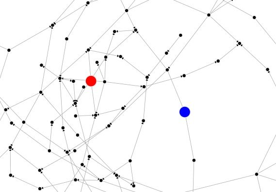

# Social Influence Game




Welcome to the Social Influence Game, a browser-based interactive simulation that challenges players to strategically add or remove connections within a network to maximize their influence over 20 turns. Each turn, players can either establish a new connection or cut an existing one to shift the balance of influence within the network.

## Play the Game Online

You can play the Social Influence Game online by clicking the following link:

[Play Social Influence Game](http://galenwilkerson.github.io/social_influence_game.html)


## Game Overview

The Social Influence Game is designed to simulate the dynamics of social influence and network theory. Players are given a budget and must make strategic decisions to outmaneuver their opponent in a finite number of turns. The game ends after 20 turns, and the player with the highest budget wins.  Funds flow from network nodes along directed edges.

## Installation

To play the Social Influence Game, follow these simple steps:

1. **Clone the Repository:**
   ```bash
   git clone https://github.com/galenwilkerson/social-influence-game.git
   ```
2. **Navigate to the Repository:**
   ```bash
   cd social-influence-game
   ```
3. **Open the Game in Your Browser:**
   Open the `index.html` file in your favorite web browser to start the game.

## How to Play

1. **Starting the Game:**
   - The game board consists of a network of nodes represented by circles.
   - Two primary nodes, red and blue, represent the players.

2. **Gameplay:**
   - Players take turns, starting randomly with either the red or blue player.
   - On each turn, a player can click on any non-primary node (not red or blue) to either establish a new connection to their primary node or cut an existing one.
   - Each action costs a point from the player's budget.
   - Players receive income based on their influence over other nodes, calculated as a fraction of the value of the nodes they influence directly.

3. **End of the Game:**
   - The game ends automatically after 20 turns.
   - The player with the highest budget at the end of the game is declared the winner.

4. **Strategies:**
   - Plan your moves to maximize influence over high-value nodes.
   - Block your opponent's strategy by cutting critical connections.
   - Manage your budget carefully; unnecessary connections could deplete your resources.

## Technologies Used

- HTML
- CSS
- JavaScript
- D3.js for dynamic visualization of the network

## Contributing

Feel free to fork the project and submit pull requests. You can also open issues to suggest improvements or report bugs. 

## License

This project is open-sourced under the MIT License. See the LICENSE file for more details.

## Author

Galen Wilkerson

Enjoy the game and may the best strategist win!
